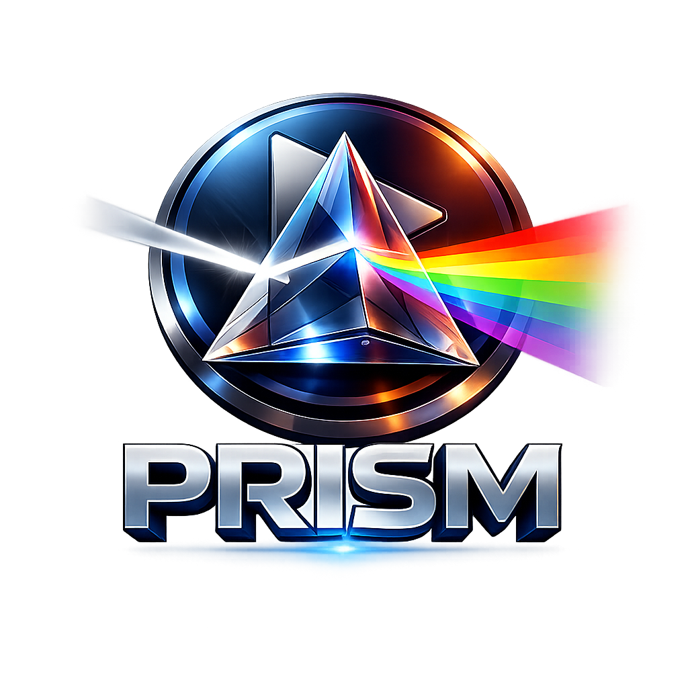
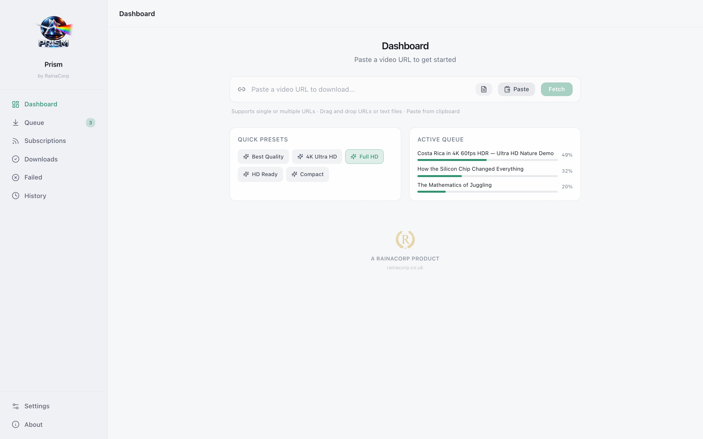

<p align="center">
  
</p>

<h1 align="center">Prism</h1>

<p align="center">
  <strong>Premium video downloader for macOS and Windows</strong><br/>
  Download from YouTube, Instagram, TikTok, and 1000+ sites — powered by yt-dlp.<br/>
  <em>by RainaCorp</em>
</p>

<p align="center">
  <a href="https://github.com/rajatraina747/prism/actions/workflows/ci.yml"></a>
  <a href="https://github.com/rajatraina747/prism/releases/latest"></a>
  <a href="LICENSE"></a>
  
</p>

---

<p align="center">
  
</p>

## Features

- **Multi-format quality selection** — Choose between 4K, 1080p, 720p, or 480p. H.264/AAC for native QuickTime playback.
- **Download queue** — True pause/resume (picks up partial files where they left off), cancel, retry, drag-to-reorder. Configurable concurrent downloads and bandwidth limits.
- **Self-updating engine** — Update the bundled yt-dlp from Settings when sites change, no app update needed.
- **Batch downloads** — Paste multiple URLs at once or import entire playlists with per-video selection.
- **Resilient by default** — Automatic retries with backoff on network failures, disk-space checks before starting, and clear, actionable error messages (sign-in walls, removed videos, geo locks, rate limits).
- **Browser cookie support** — Use cookies from Safari, Chrome, Firefox, Edge, or Brave for sign-in-required and age-restricted videos.
- **Rich media files** — Thumbnails, metadata, and chapter markers embedded in downloads.
- **Download history** — Searchable log of every download with one-click replay.
- **Clipboard auto-detect** — Copy a video URL, focus Prism, and get a one-click fetch prompt.
- **Dark and light themes** — Follows your system preference or set manually.
- **Cross-platform** — Native desktop apps for macOS (Apple Silicon + Intel) and Windows, with signed auto-updates.
- **Privacy-first** — All data stays on your machine. No accounts, no telemetry, no tracking.

See [ROADMAP.md](ROADMAP.md) for what's done and what's next.

## Download

Get the latest release for your platform:

| Platform | Download |
|----------|----------|
| macOS | [Prism.dmg](https://github.com/rajatraina747/prism/releases/latest) |
| Windows | [Prism-setup.exe](https://github.com/rajatraina747/prism/releases/latest) |
| Web Demo | [Try in your browser](https://rajatraina747.github.io/prism/) |

> **macOS note:** If macOS warns about an unidentified developer, right-click the app and choose "Open".
> **Windows note:** Windows may show a SmartScreen warning — click "More info" then "Run anyway".

## Send to Prism from your browser

Prism registers the `prism://` URL scheme. Save this bookmarklet to your bookmarks bar,
then click it on any video page to send that page straight to Prism:

```
javascript:location.href='prism://add?url='+encodeURIComponent(location.href)
```

Prism opens (or comes to the front), fetches the video, and shows the quality picker.

## Tech Stack

| Layer | Technology |
|-------|-----------|
| Frontend | React 18, TypeScript, Tailwind CSS, shadcn/ui |
| Desktop | Tauri v2 (Rust backend) |
| Download Engine | yt-dlp + Deno (bundled as sidecars) |
| Build | Vite 5 |

## Development

```bash
# Install dependencies
npm install

# Start web dev server (mock downloads)
npm run dev

# Start Tauri desktop app
npm run dev:tauri

# Run tests
npm test

# Production build (desktop)
npm run build:tauri
```

## Project Structure

```
src/
├── components/     # React components (layout, dashboard, queue, media-details)
├── hooks/          # Custom React hooks
├── pages/          # Route page components (Dashboard, Settings, History, About)
├── services/       # Service abstraction layer (mock + Tauri implementations)
├── stores/         # React Context providers (Queue, History, Settings)
├── types/          # TypeScript type definitions
└── test/           # Test setup and utilities

src-tauri/
├── src/            # Rust backend (commands, download manager, engine updater)
├── binaries/       # Bundled sidecars (yt-dlp, deno)
└── icons/          # App icons (macOS, Windows, iOS, Android)
```

## License

[MIT](LICENSE) — Copyright 2025-2026 RainaCorp

---

<p align="center">
  Built with care by <strong>RainaCorp</strong>
</p>
