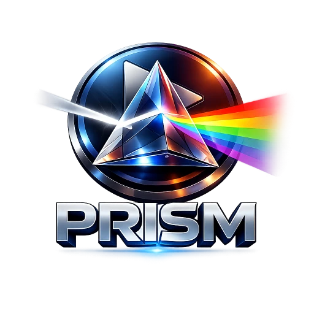
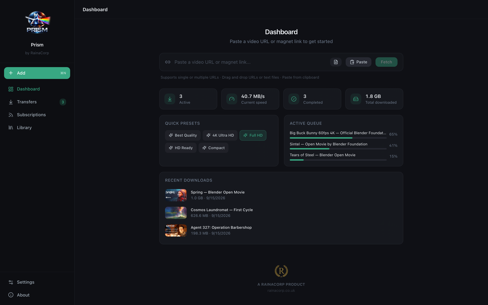
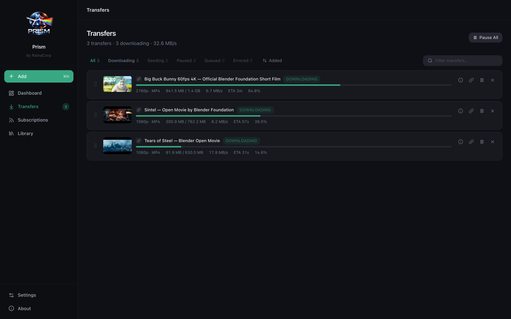

<p align="center">
  
</p>

<h1 align="center">Prism</h1>

<p align="center">
  <strong>Premium media downloader for macOS, Windows, and Linux</strong><br/>
  Download from YouTube, Instagram, TikTok, and 1000+ sites — plus magnet links and <code>.torrent</code> files.<br/>
  Powered by yt-dlp and librqbit.<br/>
  <em>by RainaCorp</em>
</p>

<p align="center">
  <a href="https://github.com/rajatraina747/prism/actions/workflows/ci.yml"></a>
  <a href="https://github.com/rajatraina747/prism/releases/latest"></a>
  <a href="LICENSE"></a>
  
</p>

---

<p align="center">
  
</p>
<p align="center">
  
</p>

## Features

- **Built-in player (macOS & Windows)** — Play any download inside Prism, powered by embedded mpv: every codec and container, true HDR on HDR displays, multichannel audio, subtitle/audio track switching. Plays individual files inside torrents too.
- **Multi-format quality selection** — Choose between 4K, 1080p, 720p, or 480p — and the resolution you pick is what you get, with a warning if a site delivers less.
- **BitTorrent downloads** — Paste a magnet link or `.torrent` file and download it in the same queue as your videos. Pick which files to grab, watch peers and share ratio live, and control seeding (stop at 100%, seed to ratio 1.0, or seed until you stop). UPnP port forwarding for peers behind a router; Quiet Hours throttles torrents too.
- **One place to add anything** — The Add button (⌘N / ⌘L from any page) takes video links, magnets, `.torrent` files and lists of links; or drop any of them anywhere in the window. Links opened from your browser ask before Prism fetches anything.
- **Download queue** — True pause/resume (picks up partial files where they left off), cancel, retry, drag-to-reorder, full keyboard control. Configurable concurrent downloads and speed limits.
- **Quiet hours** — Hold or throttle downloads during part of the day, with a banner saying until when; full speed the rest of the time.
- **Self-updating engine** — Update the bundled yt-dlp from Settings when sites change, no app update needed.
- **Batch downloads** — Paste multiple URLs at once or import entire playlists with per-video selection.
- **Resilient by default** — Automatic retries with backoff on network failures, disk-space checks before starting, and failures that say what happened and offer the fix (sign-in walls → browser cookies, removed videos, geo locks, rate limits).
- **Browser cookie support** — Use cookies from Safari, Chrome, Firefox, Edge, or Brave for sign-in-required and age-restricted videos.
- **Rich media files** — Thumbnails, metadata, and chapter markers embedded in downloads.
- **SponsorBlock** — Optionally mark sponsor segments as chapters or cut them out entirely, using crowd-sourced data.
- **Library** — Searchable record of every download with one-click replay; stays fast with thousands of entries.
- **Subscriptions** — Watch channels and playlists; new videos are queued automatically on a configurable interval.
- **Clipboard auto-detect** — Copy a video URL, focus Prism, and get a one-click fetch prompt.
- **Menu bar quick-add** — Tray icon with Paste & Download; drag a URL onto the window to fetch it.
- **Audio your way** — Extract audio-only as MP3, M4A, or Opus.
- **Browser integration** — Firefox extension and a universal bookmarklet send any page to Prism via the `prism://` scheme.
- **Dark and light themes** — Follows your system preference or set manually.
- **Cross-platform** — Native desktop apps for macOS (Apple Silicon), Windows, and Linux, with signed auto-updates.
- **Privacy-first** — All data stays on your machine. No accounts, no telemetry, no tracking. Crash reporting exists but is strictly opt-in (off by default) and contains no personal data or download history.

See [ROADMAP.md](ROADMAP.md) for what's done and what's next.

## Requirements

**ffmpeg** is needed for anything beyond a plain single-stream download: merging separate video and
audio streams (every YouTube quality above 720p), audio extraction (MP3/M4A/Opus), the embedded
thumbnails/metadata/chapters, SponsorBlock, and the MP4 remux.

**It ships with Prism on every platform** — an LGPL build, pinned by checksum, and used in
preference to anything already on your machine, so a download behaves the same everywhere and
doesn't depend on what happens to be installed. macOS gets the toolchain Prism builds itself from
pinned sources; Windows and Linux get BtbN's LGPL builds of the same ffmpeg branch.

yt-dlp, Deno and the player's libmpv are bundled too. **Nothing needs installing.**

## Download

**macOS (Apple Silicon) — Homebrew:**

```sh
brew install --cask rajatraina747/prism/prism-downloader
```

Use the full name. Homebrew's own catalogue has a different app called
`prism` (GraphPad Prism), and a bare `brew install --cask prism` or
`brew upgrade --cask prism` installs that instead. To update:
`brew upgrade --cask rajatraina747/prism/prism-downloader`, or
**Settings → Updates** inside Prism.

Or get the latest release for your platform:

| Platform | Download |
|----------|----------|
| macOS (Apple Silicon) | [Prism.dmg](https://github.com/rajatraina747/prism/releases/latest) |
| Windows | [Prism-setup.exe](https://github.com/rajatraina747/prism/releases/latest) |
| Linux | [AppImage / deb / rpm](https://github.com/rajatraina747/prism/releases/latest) |
| Web Demo | [Try in your browser](https://rajatraina747.github.io/prism/) |

> **macOS note:** Prism is signed but not notarized (no paid Apple developer account), so macOS
> shows "Apple could not verify Prism is free of malware" the first time. On **macOS 15 and later**
> the right-click → Open trick no longer works: open the app once, then go to
> **System Settings → Privacy & Security**, scroll down and click **Open Anyway**. Or, from a terminal:
>
> ```sh
> xattr -dr com.apple.quarantine /Applications/Prism.app
> ```
>
> The Homebrew cask above avoids the dialog on most setups. In-app updates carry the same signature,
> so this only happens on first install.
>
> **Windows note:** Windows may show a SmartScreen warning — click "More info" then "Run anyway".

## Send to Prism from your browser

Prism registers the `prism://` URL scheme, and there are two ways to use it:

**Firefox extension** — see [extension/firefox](extension/firefox/): a toolbar
button and right-click menu ("Download this page/link in Prism"). Load it
temporarily via `about:debugging`, or package it for AMO (instructions in the
folder).

**Bookmarklet (any browser)** — save this to your bookmarks bar, then click it
on any video page:

```
javascript:location.href='prism://add?url='+encodeURIComponent(location.href)
```

Either way, Prism opens (or comes to the front), fetches the video, and shows the quality picker.

**Magnet & .torrent links** — Prism registers as a handler for `magnet:` links
and `.torrent` files. After installing, set Prism as your default in your OS's
default-apps settings (an existing client like µTorrent keeps the default until
you change it), then clicking a magnet on a torrent site opens Prism with the
file picker. You can also just paste a magnet into the URL box any time.

## Tech Stack

| Layer | Technology |
|-------|-----------|
| Frontend | React 18, TypeScript, Tailwind CSS, shadcn/ui |
| Desktop | Tauri v2 (Rust backend) |
| Download Engines | yt-dlp + Deno (bundled sidecars) · librqbit (embedded BitTorrent) |
| Build | Vite 5 |

## Development

```bash
# Install dependencies
npm install

# Start web dev server (mock downloads)
npm run dev

# Start Tauri desktop app
npm run dev:tauri

# Run tests
npm test                 # unit & component (Vitest)
npx playwright test      # end-to-end against the web demo
cd src-tauri && cargo test --lib

# Regenerate the README screenshots (with `npm run dev` running)
node scripts/readme-screenshots.mjs

# Production build (desktop)
npm run build:tauri
```

### Bundled binaries (yt-dlp, Deno, libmpv)

Every third-party binary that ships inside a release is pinned by version **and SHA-256** in
[`scripts/sidecars.lock`](scripts/sidecars.lock). Fetch them (verified) with:

```bash
scripts/fetch-sidecars.sh macos            # or windows / linux
scripts/fetch-sidecars.sh macos --player   # also assembles the embedded player's libmpv tree
```

CI uses the same script, so a release can never pick up an unverified "latest" build. To move to newer
upstream releases, run `scripts/update-sidecars.sh`, review the lockfile diff, and commit.

### Release checklist

- `npm audit --omit=dev --audit-level=high` and `cargo audit` (in `src-tauri/`) are CI gates.
- `RELEASE_NOTES.md` is the release body — update it *before* tagging.
- The npm `@tauri-apps/api` and Rust `tauri` crate must be on the same minor.
- After the release is published, bump the Homebrew cask in `rajatraina747/homebrew-prism`.
- The updater signing key: backup, encryption and rotation are in [`docs/RELEASE-KEYS.md`](docs/RELEASE-KEYS.md).

Found a security issue? See [SECURITY.md](SECURITY.md) — please report it privately.

## Project Structure

```
src/
├── components/     # React components (layout, dashboard, queue, media-details)
├── hooks/          # Custom React hooks
├── pages/          # Route page components (Dashboard, Queue, Subscriptions, History, Settings, …)
├── services/       # Service abstraction layer (mock + Tauri implementations)
├── stores/         # State: queue reducer + providers (Queue, History, Settings, Subscriptions)
├── types/          # TypeScript type definitions
└── test/           # Test setup and utilities

src-tauri/
├── src/            # Rust backend (commands, download manager, engine updater)
├── binaries/       # Bundled sidecars (yt-dlp, deno)
└── icons/          # App icons (macOS, Windows, iOS, Android)
```

## License

Prism's source code is [MIT](LICENSE) — Copyright 2025-2026 RainaCorp.

The **release builds** also contain third-party software under its own licenses: yt-dlp (Unlicense),
Deno (MIT), librqbit (Apache-2.0), and the embedded player's libraries. Both desktop builds use an
**LGPL** mpv and FFmpeg — macOS from the toolchain Prism builds itself from pinned sources
(`scripts/build-media-macos.sh`, `scripts/toolchain.lock`), Windows from zhongfly's LGPL build — so
no GPL codec (x264, x265, Rubber Band) is linked into either. The build refuses to publish if one
appears.

As the LGPL requires, the corresponding source for the macOS libraries is published beside the
binaries on the `media-toolchain-*` release pinned in `scripts/sidecars.lock`: every upstream
tarball byte for byte, together with the script that patches and builds them. License texts ship
inside the app (`resources/lib/licenses`, with `VERSIONS.txt`), and the full list is under
Settings → Legal → Open Source Licenses.

---

<p align="center">
  Built with care by <strong>RainaCorp</strong>
</p>
